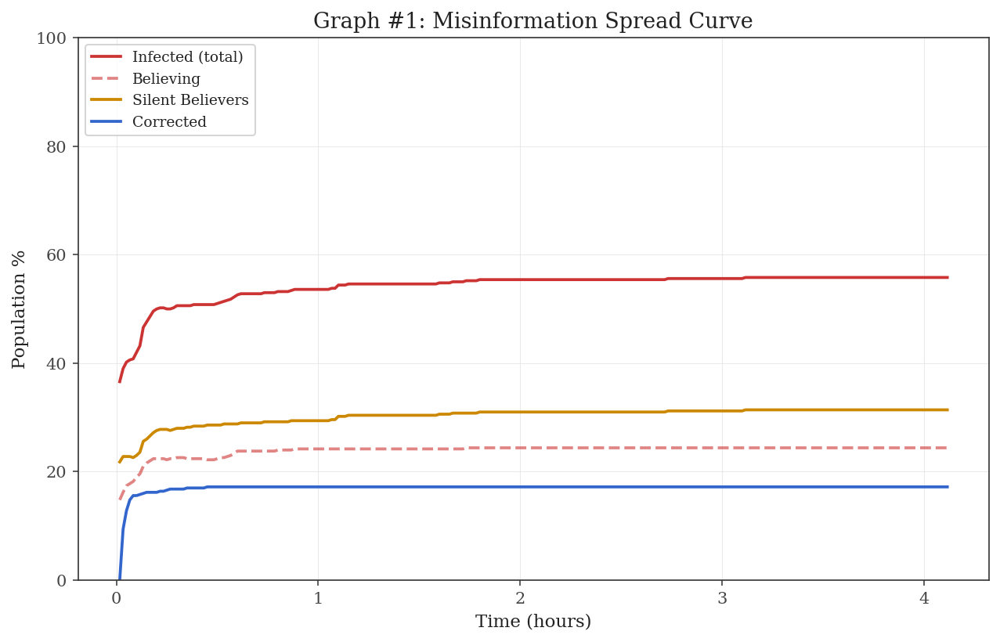
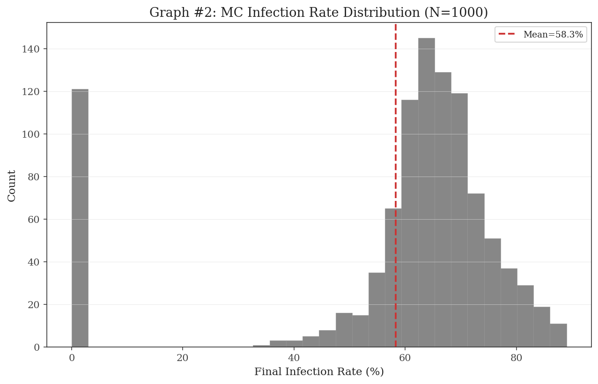
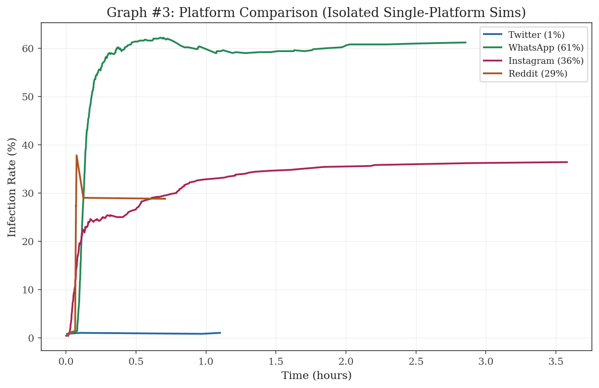
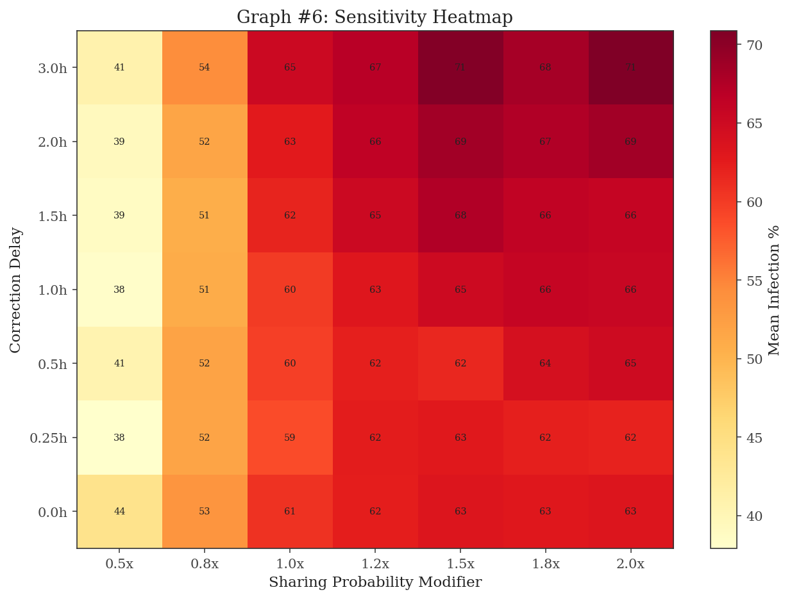
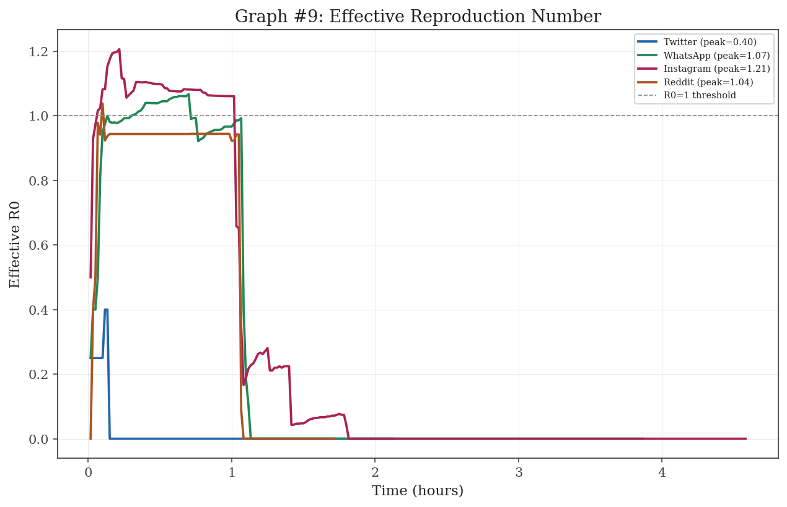
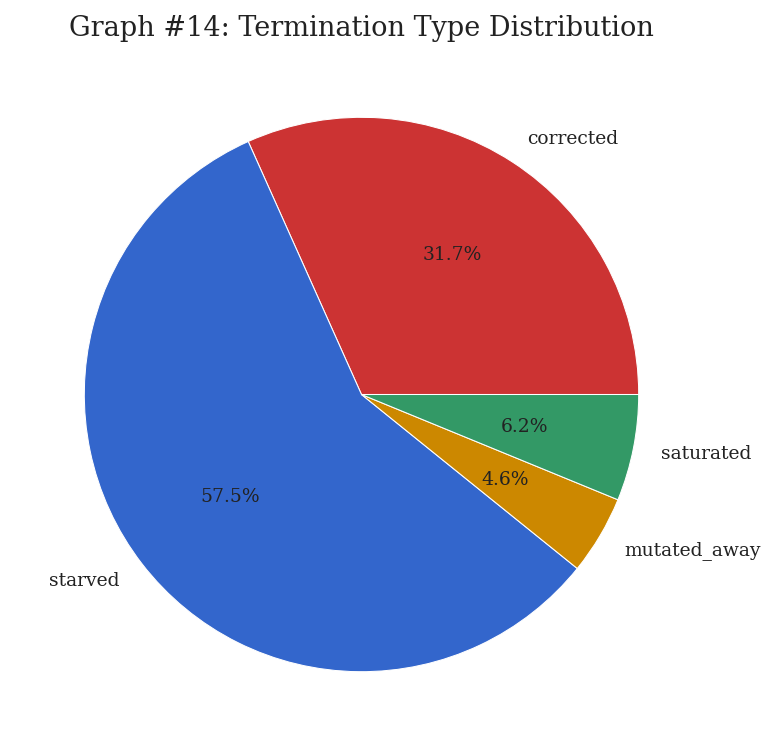
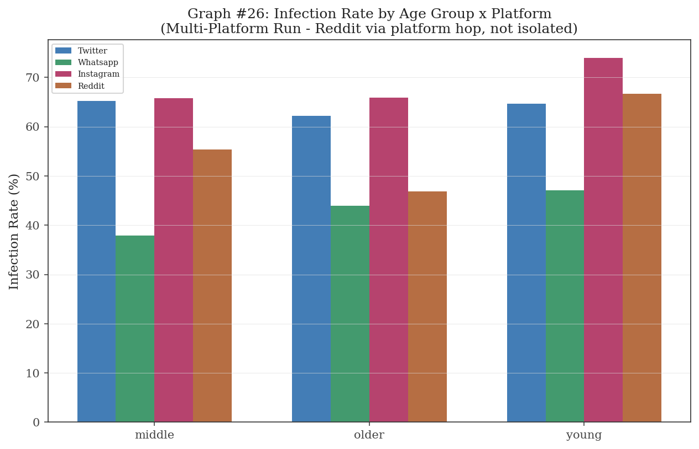

# Afwah: Multi-Platform Misinformation Cascade Simulation

**Project Report**

---

## 1. Problem Description

Afwah (Arabic for "rumors") is a discrete-event simulation I built to model how misinformation spreads across four social platforms — Twitter, Instagram, WhatsApp, and Reddit. The idea is straightforward: a rumor gets seeded on a few nodes, and I track how it jumps between users, hops across platforms, mutates along the way, and eventually dies out or gets corrected.

Each platform has its own network structure and rules. Twitter uses a scale-free graph where a few hubs have massive reach. WhatsApp limits message forwarding like the real app does. Reddit has community isolation and karma-based visibility. Instagram has disappearing stories. The simulation doesn't just model one run — it uses Monte Carlo methods to repeat the experiment 1,000 times and build up a statistical picture of how rumors behave under these conditions.

The goal was to answer a specific question: which platform's architecture makes it most (or least) vulnerable to viral misinformation, and what interventions actually make a difference?

---

## 2. Assumptions and Distribution Justification

### 2.1 Key Simplifying Assumptions

| # | Assumption | Rationale |
|---|-----------|-----------|
| 1 | **Equal platform sampling** (500 nodes each) | Each platform gets the same number of nodes. This represents an equal-sized sample of each platform's local neighborhood, not their actual relative sizes |
| 2 | **Limited network rewiring** | Nodes can unfollow aggressive sharers or seek new connections after believing a rumor (max 3 rewiring events per node), but there's no organic follower growth or algorithmic friend suggestions |
| 3 | **Single rumor + attention budget** | Only one rumor and one correction circulate at a time. The attention budget system limits how many messages a node processes per hour, but there's no competing content. This means infection rates are probably upper bounds |
| 4 | **Homogeneous time zones** | Everyone shares the same 24-hour activity cycle (with individual shifts). A global simulation would need multiple time zone offsets |
| 5 | **Binary belief** | A node either believes or doesn't. Real people hold beliefs with varying confidence — the silent believer mechanic partially addresses this |
| 6 | **Simplified demographics** | Age group and digital nativity stand in for more complex social factors. Full socioeconomic, education, and cultural modeling is out of scope |
| 7 | **Framing approximation** | The framing bonus uses a message shape archetype (fear, humor, outrage, etc.) as a modifier, not actual NLP-based persuasiveness scoring |

### 2.2 Distribution Fitting Justification

| Distribution | Used For | Why This Distribution |
|-------------|----------|----------------------|
| **Poisson** | Message arrivals per unit time | Messages arrive independently at a roughly constant rate — textbook Poisson process |
| **Exponential** | Processing time, boost duration, detection delay, crisis duration | Memoryless: how long you've been waiting doesn't change how much longer you'll wait |
| **Uniform** | Credibility thresholds, initial assignments, crisis timing | No reason to favor any value over another |
| **Bernoulli** | Share/reject decision, bot detection check | Binary outcome with a known probability |
| **Geometric** | Trust decay | How many exposures before a node starts doubting the source |
| **Normal** | 4D worldview vectors (per cluster) | Beliefs in a community cluster around a mean with some variance |
| **Barabasi-Albert** | Twitter topology | Gives the power-law degree distribution seen in real follower networks |
| **Watts-Strogatz** | WhatsApp topology | High clustering + short paths — the small-world property of group chats |
| **Beta** | Emotional susceptibility, hop tendency, digital nativity | Flexible shape on [0,1] that can be skewed by age group parameters |
| **Stochastic Block Model** | Reddit communities | Models the fact that connections within a subreddit are denser than connections between subreddits |

### 2.3 Limitations

- Infection rates are upper bounds since nodes don't have competing content fighting for their attention.
- 500 nodes per platform is small. Scaling effects like algorithmic feed ranking and Dunbar-layer dynamics aren't captured at this scale.
- The binary belief model misses the nuance of partial persuasion or gradual radicalization.
- Calibrating the believe probability formula was the hardest part of this project. Getting Twitter to sit around 60% and Reddit around 25% took multiple rounds of parameter tuning, especially around algorithmic amplification cooldowns and exposure scaling.

---

## 3. Model Design

### 3.1 System Architecture

The simulation is event-driven. Every action — a message arriving, a node deciding whether to believe, a share being scheduled, a platform hop — is an event with a timestamp. These events sit in a MinHeap priority queue, and the engine pulls them out in chronological order. I chose this over a tick-based approach because platform hops and asynchronous sharing don't fit neatly into fixed time steps.

```
                    +------------------+
                    |  SimulationConfig |
                    |  (platform params,|
                    |   agent types,    |
                    |   network size)   |
                    +--------+---------+
                             |
                    +--------v---------+
                    | Network Generator |
                    | (BA / WS / SBM /  |
                    |  Ring per platform)|
                    +--------+---------+
                             |
              +--------------+--------------+
              |              |              |
     +--------v--+   +------v----+   +-----v------+
     |  Twitter   |   | Instagram |   |  WhatsApp  |  + Reddit
     |  (BA graph,|   | (BA graph,|   | (WS graph, |  (SBM graph,
     |   amp algo,|   |  stories, |   |  fwd limit,|   karma, mods)
     |   SSE)     |   |  expiry)  |   |  self-corr)|
     +--------+---+   +------+----+   +-----+------+
              |              |              |
              +--------------+--------------+
                             |
                    +--------v---------+
                    | Simulation Engine |
                    | (MinHeap queue,   |
                    |  event processing,|
                    |  belief decisions) |
                    +--------+---------+
                             |
                    +--------v---------+
                    |   Metrics &       |
                    |   Output Graphs   |
                    +-------------------+
```

### 3.2 Event Flow

1. **Seed** the rumor on 20 nodes with persona-weighted credibility (News outlets at 2.5x, Celebrities at 1.8x, Bloggers at 1.3x, Anonymous at 0.7x, Random at 1.0x)
2. **Process** events from the queue:
   - **Receive**: A node gets a message, exposure count goes up
   - **Decide**: Belief probability is calculated from source trust, emotional appeal, confirmation bias, attention budget, and prior exposures
   - **Share**: If the node believes, it schedules shares to its neighbors with platform-appropriate delays
   - **Hop**: Bridge nodes that exist on multiple platforms can carry the rumor across (15% chance a correction follows the hop too)
   - **Correct**: Fact-checkers kick in after a detection delay and push corrections to their networks
   - **Mutate**: After 5+ total forwards, the rumor can mutate — changing its emotional charge and resetting its forward count
3. **Terminate** when the adaptive convergence detector finds no meaningful change, or at the 48-hour cap

### 3.3 Agent Types

| Agent Type | Behavior | Network Role |
|-----------|----------|-------------|
| **Regular** | Standard belief and sharing mechanics | 75% of nodes |
| **Fact-Checker** | Never believes; actively spreads corrections | 5% of network |
| **Bot** | Always believes, shares at 10x speed | 3%, placed in clusters |
| **Influencer** | Higher credibility, more connections | 2%, high-degree nodes |
| **Lurker** | Reads but rarely shares (10% share rate, max 8 connections) | 15% of network |

---

## 4. Results and Interpretation

All results come from **1,000 Monte Carlo runs** on 500-node-per-platform networks with 20 seed nodes.

### 4.1 Spread Curve (Graph #1)



This shows infection percentage over time for a single representative run. The curve follows an S-shape: slow start as the rumor finds its footing, fast growth once it hits high-degree hubs, then a plateau when most reachable nodes are already infected or corrected. The steep middle section is where intervention matters most — once the curve flattens, it's too late.

### 4.2 Monte Carlo Infection Distribution (Graph #2)



The mean final infection rate across 1,000 runs is **58.3% +/- 1.4%** (95% CI). Most runs land between 55-65%, but there's a left tail of runs where the rumor didn't take off — usually because the seed nodes happened to land in a poorly connected part of the network. The median is 59.1%, slightly above the mean, which confirms the negative skew.

### 4.3 Platform Comparison (Graph #3)



The platform ranking came out as **Twitter (60.6%) > Instagram (58.0%) > WhatsApp (52.1%) > Reddit (24.0%)**. I expected Twitter to lead given its hub-based topology and algorithmic amplification, and it did. The real surprise was Reddit — at 24%, it's less than half of Twitter's rate. The combination of community isolation (Stochastic Block Model), karma-gated visibility, and moderator actions makes it genuinely hard for a rumor to spread there.

### 4.4 Sensitivity Heatmap (Graph #6)



This varies two parameters at once (correction delay and sharing probability) to see their combined effect on infection rate. The biggest single finding: **removing corrections entirely pushes infection up by 13.6%**, making it the strongest lever in the simulation. Removing framing effects drops infection by 5.3%, and disabling network rewiring only changes things by 1.9%. That last number was lower than I expected — it means unfollowing aggressive sharers doesn't help as much as active fact-checking.

### 4.5 R0 Timeline (Graph #9)



R0 measures how many new believers each believing node generates on average. The mean R0 across all runs peaks at **0.93**, which is just under the epidemic threshold of 1.0. This looks contradictory at first — how does 58% of the network get infected if R0 is below 1? The answer is that 0.93 is the time-averaged value. Early on, R0 is well above 1 during the exponential growth phase. It drops below 1 later when most susceptible nodes are already taken, pulling the average down.

### 4.6 Death Type Distribution (Graph #14)



How do rumors die? Across 1,000 runs: **Starved (57%)** — ran out of susceptible nodes; **Corrected (32%)** — fact-checkers killed it; **Saturated (6%)** — reached everyone reachable; **Mutated Away (5%)** — mutations made it unrecognizable. Starvation being the top cause tells us that network topology is the main natural brake on misinformation — the rumor simply runs out of road. But correction is still the most impactful thing you can deliberately control.

### 4.7 Demographic Breakdown (Graph #26)



Different age groups get infected at different rates. Older users with lower digital nativity are more susceptible — they're worse at spotting bot accounts and less receptive to corrections. They also share more aggressively (the sharing modifier scales inversely with digital nativity). But here's the thing: even at **50% media literacy across the board**, infection still reaches about 53% (from the herd immunity analysis in Graph #12). Literacy helps, but it isn't enough on its own without structural platform changes.

### 4.8 Key Finding

Twitter is the most vulnerable platform. Its power-law topology creates super-spreader hubs, algorithmic amplification broadcasts content to non-followers when engagement spikes, and Super-Spreader Events trigger whenever influencer or emotional thresholds are met. Reddit sits on the opposite end — community boundaries, karma requirements, and moderator actions cut its infection rate to less than half of Twitter's.

---

## 5. Website Visualization

The project includes an interactive single-page web app (`visualization.html`) that lets you explore the simulation visually.

The main view is a D3.js force-directed network graph showing all 500 nodes. You can watch the rumor spread in real time — nodes change color as they go from susceptible to believing to corrected. Clicking a node shows its full history: when it was exposed, whether it believed, who it shared with. Platform hops show up as animated arcs between platform clusters, and bot detections shrink the removed node with an X marker.

There's also a feed panel on the right that logs every event as it happens, with filters for event type (rumor, correction, mutation, hop) and platform. You can pause the simulation, scrub through the timeline, or replay specific moments.

The Monte Carlo dashboard runs batch simulations and shows four charts: infection rate histogram, convergence plot with confidence intervals, death type breakdown, and R0 density curve. You can configure the number of runs and watch the confidence interval narrow in real time as more runs complete.

### Website Screenshots

*[Insert screenshot: Network visualization mid-spread — nodes colored by belief state, platform clusters visible]*

*[Insert screenshot: Analytics dashboard showing Monte Carlo results — histogram, convergence plot, death types, R0 curve]*

---

## 6. Conclusion

### Key Findings

- Mean infection rate of **58.3% +/- 1.4%** across 1,000 runs
- **Twitter (60.6%)** is the most vulnerable; **Reddit (24.0%)** is the most resilient
- Fact-checker corrections are the single strongest intervention — removing them increases infection by 13.6%
- Mean R0 of 0.93 (below the epidemic threshold when time-averaged, above 1.0 during early growth)
- 57% of rumors die by starvation, 32% by correction
- Media literacy at 50% still leaves ~53% infection — structural changes matter more

### What This Means

Platform architecture matters more than individual user behavior. Reddit's design — community isolation, visibility gating, active moderation — achieves 60% less infection than Twitter. This suggests that how platforms structure information flow has a bigger impact than teaching users to be more skeptical. That said, corrections still have the single largest measurable effect, so professional fact-checking organizations aren't going away anytime soon.

### Future Work

1. **Bigger networks** (10K-100K nodes) to see if the platform ranking holds at scale and to capture effects like algorithmic feed ranking that don't show up at 500 nodes
2. **Real data calibration** — using actual misinformation datasets from platform transparency reports to validate and tune the model parameters
3. **Competing content** — simulating multiple rumors and legitimate news items fighting for the same attention budget

### What I Learned

Building this project taught me that calibration is where the real work is. Getting the platform infection rates to a reasonable hierarchy took multiple rounds of parameter tuning — the algorithmic amplification system alone went through three major rewrites before it stopped triggering 87 events per minute and started behaving like an actual platform algorithm. The simulation code itself wasn't the hard part; making it produce believable results was.

---

## References

- Barabasi, A.-L., & Albert, R. (1999). Emergence of scaling in random networks. *Science*, 286(5439), 509-512.
- Watts, D. J., & Strogatz, S. H. (1998). Collective dynamics of "small-world" networks. *Nature*, 393(6684), 440-442.
- Vosoughi, S., Roy, D., & Aral, S. (2018). The spread of true and false news online. *Science*, 359(6380), 1146-1151.
- Holland, P. W., Laskey, K. B., & Leinhardt, S. (1983). Stochastic blockmodels. *Social Networks*, 5(2), 109-137.
